# RealityGlitchArt

**Shader Graph** examples for visionOS2.0+/iOS18+, this project uses **Surface Shader** to  achieve a cyberpunk-2077-style glitch art effect. The algorithm of this project originates from https://github.com/QianMo/X-PostProcessing-Library  (RIP)

适用于 visionOS2.0+/iOS18+ 的 **Shader Graph** 示例程序，使用 **Surface Shader**，实现类似赛博朋克2077的故障艺术（GlitchArt）效果。本项目计算思路来自于 https://github.com/QianMo/X-PostProcessing-Library   (RIP)

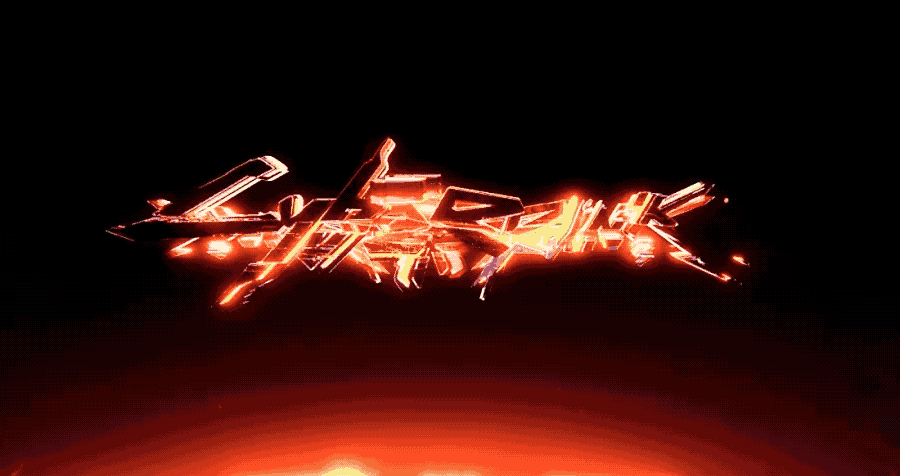

**The Reality Composer Pro** can be used to view and modify, and you can also run the **Demo** to view the effect on the Vision Pro or on a **Simulator**.

可使用 **Reality Composer Pro** 进行查看和修改，也可运行 **Demo** 在 Vision Pro 或 **模拟器** 上查看效果。

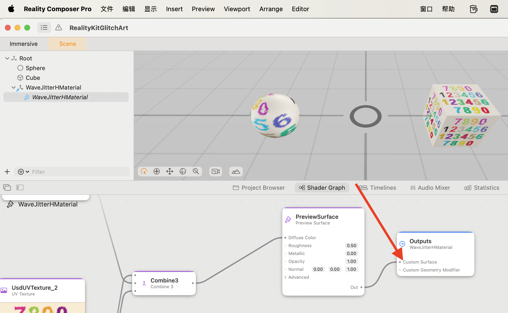

## GlitchArt 故障艺术

* AnalogNoise：模拟噪点

  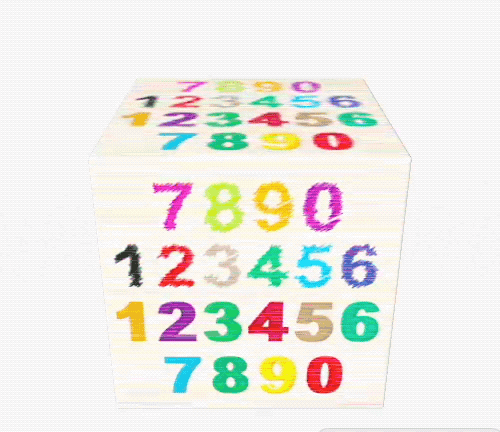

* DigitalStrpe(H/V)：数字条纹（水平/竖直）

  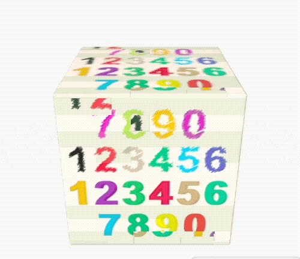 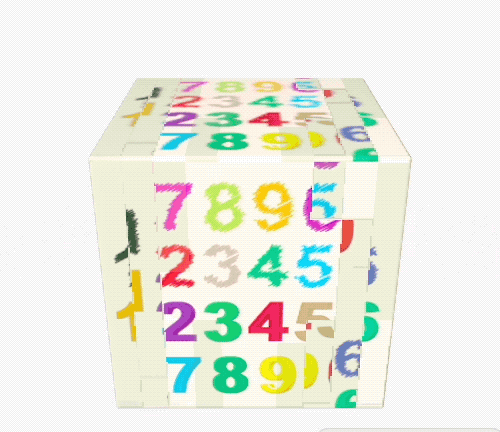

* ImageBlock(V1/V2/V3/V4)：图块错位（(V1/V2/V3/V4)）

  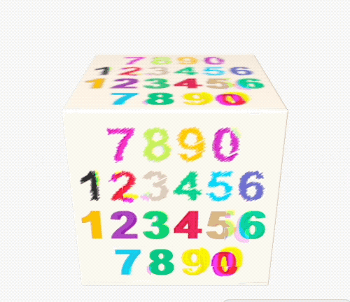 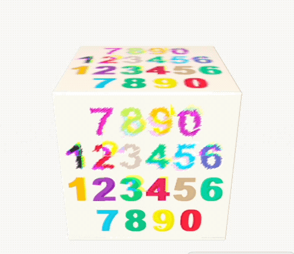
  
  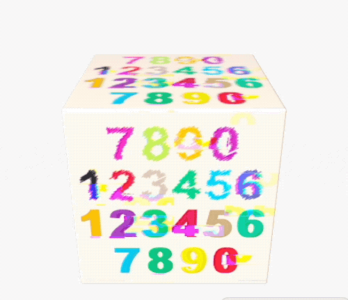 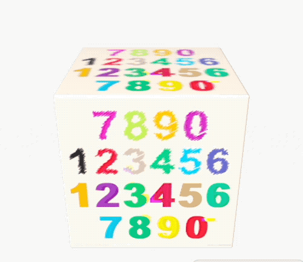 

* LineBlock(H/V)：线条错位（水平/竖直）

  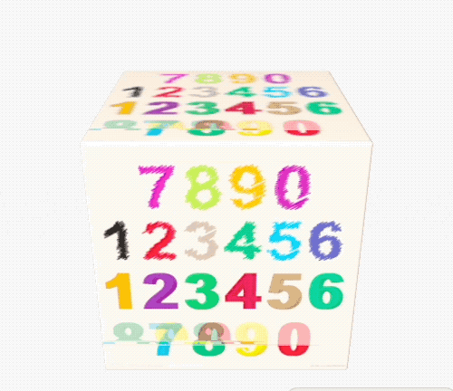 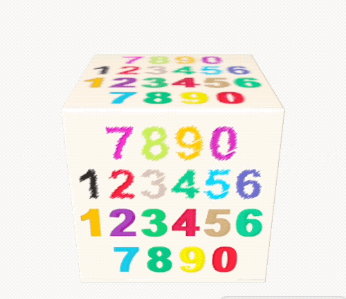

* RGBSplit(V1/V2/V3/V4/V5)：RGB 色调分离（V1/V2/V3/V4/V5）

  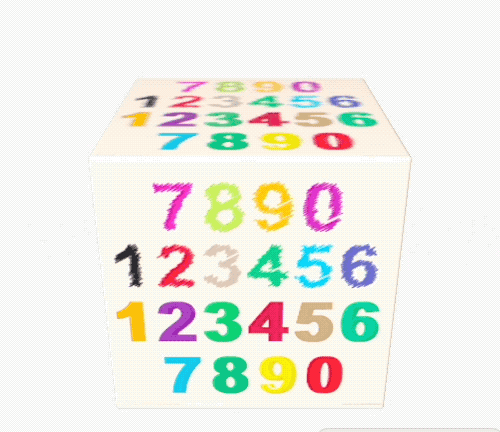 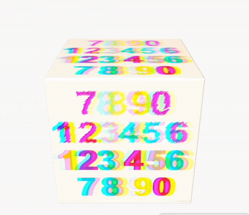
  
   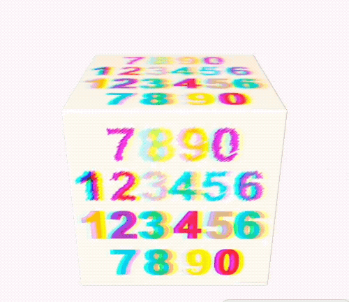 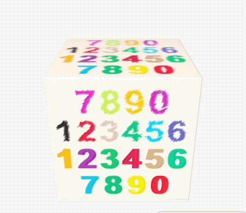 

* ScanLineJitter(H/V)：扫描线故障（水平/竖直）

   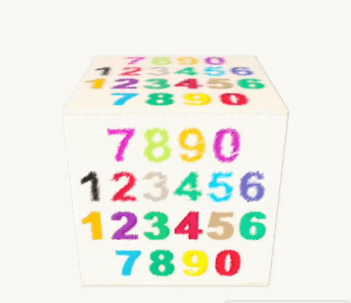

* ScreenJump(H/V)：屏幕跳跃（水平/竖直）

  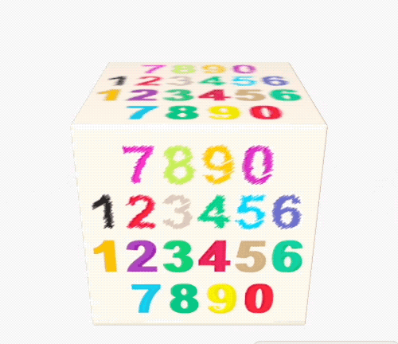 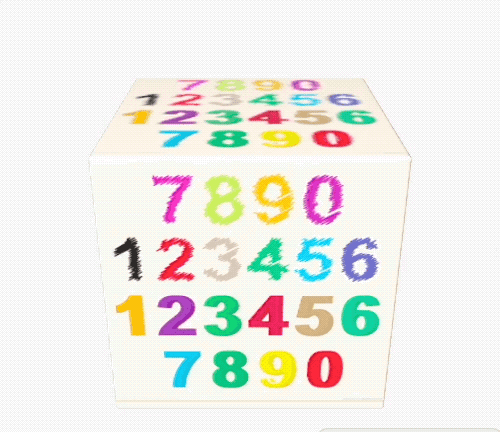

* ScreenShake(H/V)：屏幕抖动（水平/竖直）

  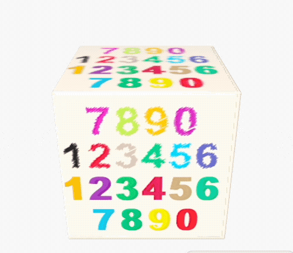 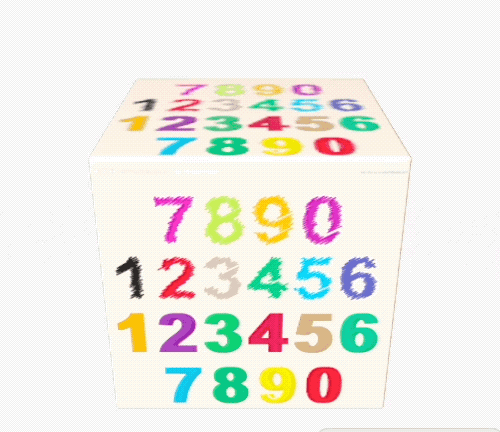

* TileJitter(H/V)：图块抖动（水平/竖直）

  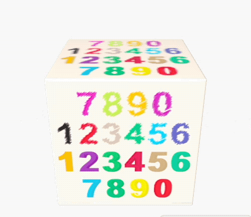 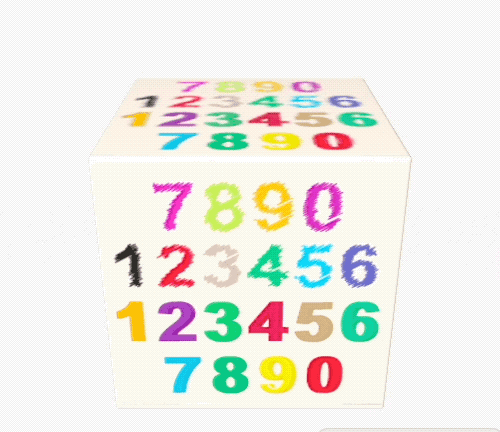

* WaveJitter(H/V)：波动抖动（水平/竖直）

  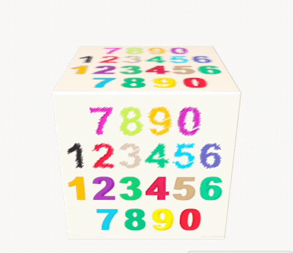 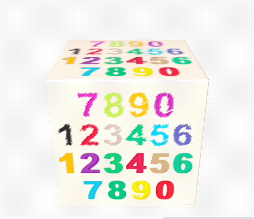

## NoiseVisualization 噪声可视化

The built-in noise node in Reality Composer Pro was also tested and visualized in the demo.

在 Demo 中，也对 Reality Composer Pro 中自带的噪声生成节点进行了测试，并进行了可视化展示。

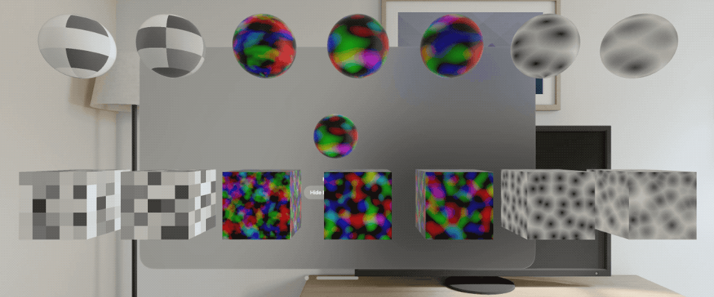

## Reference 参考
* https://github.com/XanderXu/ShaderForRealityKit
* [高品质后处理：十种故障艺术(Glitch Art)算法的总结与实现](https://zhuanlan.zhihu.com/p/148256756)
* https://github.com/QianMo/X-PostProcessing-Library
